# Cifrado de datos en reposo con AWS KMS

**Autor:** Marcos Gastón Guevara  

**Fecha:** 08/03/2026  

**Laboratorio:** AWS Academy - Cifrado con KMS

## 📋 Demostración

En este laboratorio se demuestra:

- Crear y gestionar claves de cifrado en AWS KMS

- Usar esas claves para cifrar datos en S3 (archivos)

- Cifrar volúmenes de EBS (discos de EC2)

- Auditar el uso de claves con CloudTrail

- Observar qué pasa cuando una clave se deshabilita (¡importante!)

---

## 🗝️ TAREA 1: CREACIÓN DE CLAVE KMS

### Objetivo

Crear una clave simétrica administrada por el cliente en AWS KMS que usaremos para proteger datos en S3 y EBS.

### Procedimiento realizado

1. Accedimos a la consola de AWS KMS

2. Navegamos a "Claves administradas por el cliente"

3. Hicimos clic en "Crear clave"

4. Seleccionamos **Simétrica** como tipo de clave

5. Asignamos el alias **MyKMSKey**

6. Designamos al rol **voclabs** como administrador de la clave

7. Designamos al rol **voclabs** como usuario de la clave

8. Revisamos y finalizamos la creación

### Detalle técnico

Se creó una clave simétrica de 256 bits con las siguientes características:

- **Tipo:** Clave administrada por el cliente (Customer Managed Key)

- **Alias:** MyKMSKey

- **ID de clave:** 1aa42398-190f-48f2-be6b-0fe50b15a746

- **Administradores:** rol voclabs (usuario actual del laboratorio)

- **Usuarios autorizados:** rol voclabs

Las claves simétricas en AWS KMS son ideales para cifrado en reposo porque:

- Nunca salen de AWS KMS sin cifrar

- Permiten control granular de permisos (quién administra vs. quién usa)

- Se integran nativamente con servicios como S3 y EBS

- Generan un registro auditable en CloudTrail

### Evidencia

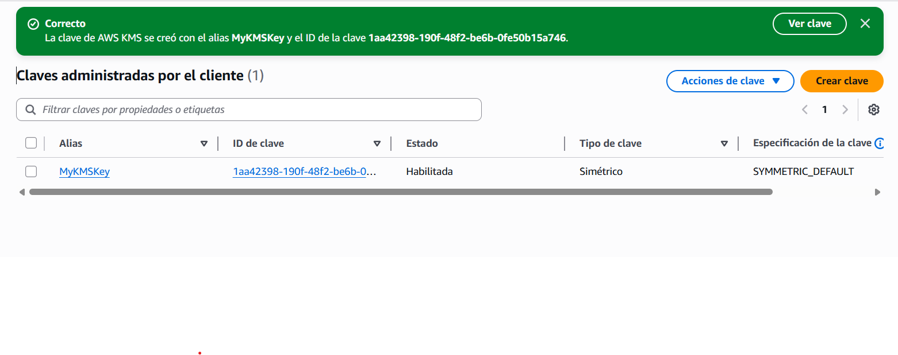

> **Nota:** La clave quedó correctamente creada con estado "Habilitada", lista para ser utilizada en las siguientes tareas.

## 📦 TAREA 2: CIFRADO DE OBJETO EN AMAZON S3

### Objetivo

Almacenar un objeto en Amazon S3 utilizando cifrado del lado del servidor con AWS KMS (SSE-KMS).

### Procedimiento realizado

1. Accedimos al bucket **ImageBucket** en la consola de S3

2. Seleccionamos el archivo `clock.png` para cargar

3. En las propiedades de carga, activamos **"Anular configuración de cifrado"**

4. Seleccionamos **SSE-KMS** como método de cifrado

5. Elegimos nuestra clave **MyKMSKey** (ARN: `arn:aws:kms:us-east-1:830231096724:key/1aa42398-190f-48f2-be6b-0fe50b15a746`)

6. Completamos la carga del archivo exitosamente

### Detalle técnico

El archivo se almacenó utilizando **SSE-KMS (Server-Side Encryption with KMS)**, lo que significa:

- S3 solicitó a KMS una **clave de datos** única para este objeto

- KMS generó la clave de datos utilizando `MyKMSKey`

- El archivo se cifró con esa clave de datos

- La clave de datos se cifró nuevamente con `MyKMSKey` y se almacenó como metadatos del objeto

- Sin acceso a `MyKMSKey`, es imposible descifrar la clave de datos y, por lo tanto, al archivo.

### Evidencias

**Carga exitosa del archivo:**

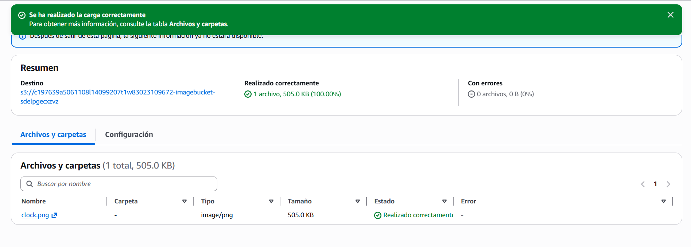

**Configuración de cifrado SSE-KMS con MyKMSKey:**

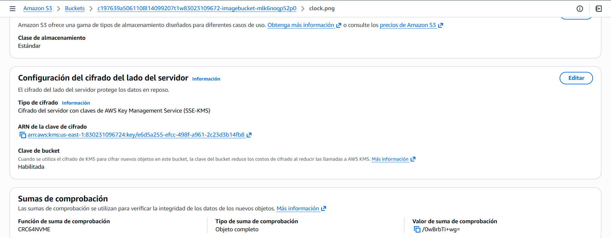

> **Nota importante:** Las dos capturas demuestran que:

> 1. El archivo se subió correctamente (sin errores)

> 2. Se utilizó **SSE-KMS** con nuestra clave específica, no el cifrado por defecto de S3

## 🌐 TAREA 3: INTENTO DE ACCESO PÚBLICO AL OBJETO CIFRADO

### Objetivo

Demostrar que un objeto cifrado con SSE-KMS no es accesible públicamente, incluso cuando se configuran permisos de lectura pública, debido a los requisitos de autenticación de AWS KMS.

### Procedimiento realizado

#### 3.1 Primer intento: Acceso directo (bucket privado)

1. Copiamos la URL del objeto `clock.png` desde S3

2. Intentamos acceder en una ventana de navegador privada

3. Resultado: **Error "Access Denied"** (esperado, bucket privado)

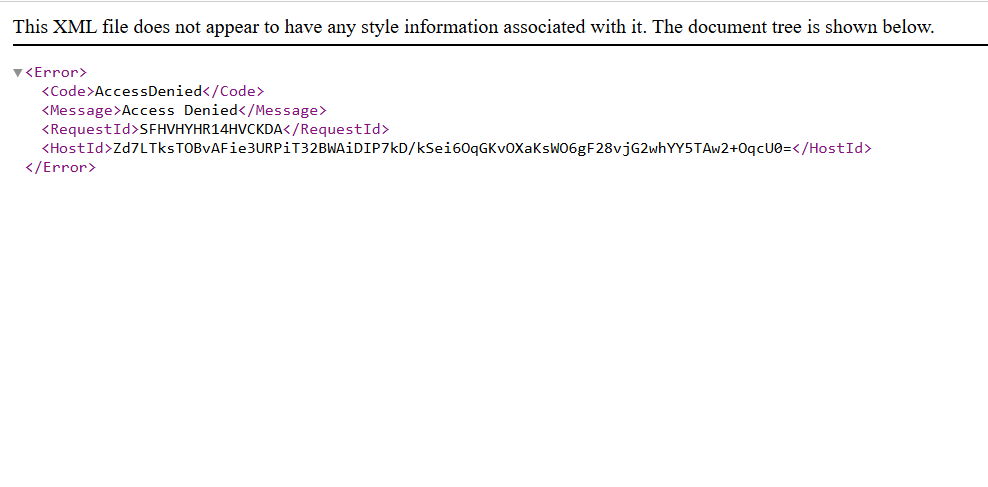

#### 3.2 Modificación de permisos del bucket

1. En la pestaña **Permisos** del bucket, editamos **Bloquear acceso público**

2. Desmarcamos **"Bloquear todo el acceso público"**

3. Confirmamos los cambios

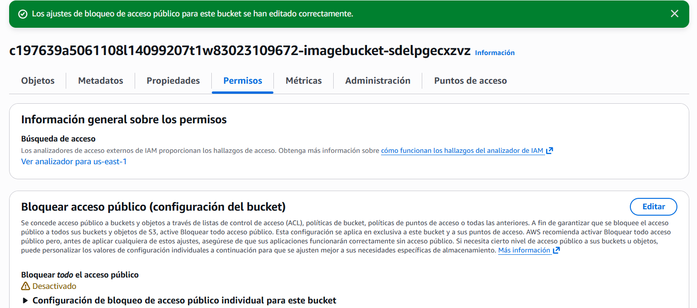

#### 3.3 Segundo intento: Acceso público (bucket público, objeto público)

1. Volvemos a cargar la misma URL del objeto

2. Resultado: **Error "Invalid Argument"** con mensaje sobre Signature Version 4

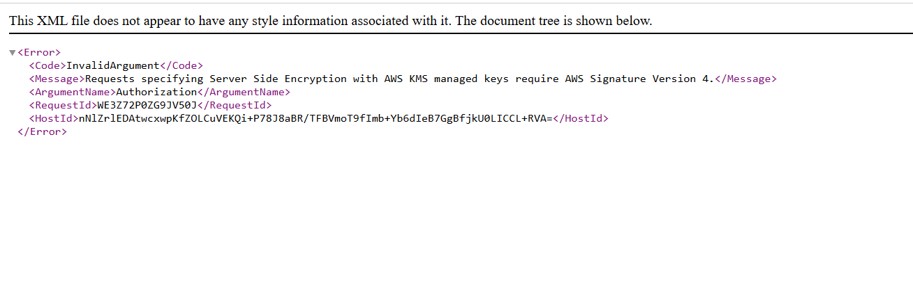

## Análisis técnico

Este comportamiento demuestra un principio fundamental de seguridad:

| Condición | Resultado | Explicación |
| :--- | :--- | :--- |
| Bucket privado, objeto privado | ❌ **Access Denied** | El bucket bloquea todo acceso anónimo |
| Bucket público, objeto público | ❌ **Invalid Argument** | El objeto está cifrado con SSE-KMS, requiere autenticación firmada (Signature Version 4) |

**Conclusión clave:**  

El cifrado con KMS agrega una capa adicional de seguridad. Incluso si los permisos de S3 se configuran incorrectamente y un objeto se vuelve público accidentalmente, el atacante **no podrá leerlo** a menos que también tenga permisos para usar la clave KMS.

Esto ejemplifica el principio de  **defensa en profundidad** : múltiples capas de seguridad protegen los datos.

## 🔐 TAREA 4: ACCESO FIRMADO AL OBJETO CIFRADO

### Objetivo

Demostrar que un usuario autenticado puede acceder al objeto cifrado, ya que la consola de S3 genera automáticamente una solicitud firmada (Signature Version 4).

### Procedimiento realizado

#### 4.1 Acceso desde la consola de S3

1. En la consola de S3, dentro del bucket, seleccionamos `clock.png`

2. Hacemos clic en el botón **"Abrir"**

3. La imagen se carga correctamente en una nueva pestaña

#### 4.2 Análisis de la URL generada

Al abrir la imagen, la consola generó automáticamente una **URL prefirmada** que incluye:

- Credenciales temporales (`X-Amz-Credential`)

- Algoritmo de firma (`X-Amz-Algorithm=AW54-HMAC-SHA256`)

- Fecha y hora de expiración

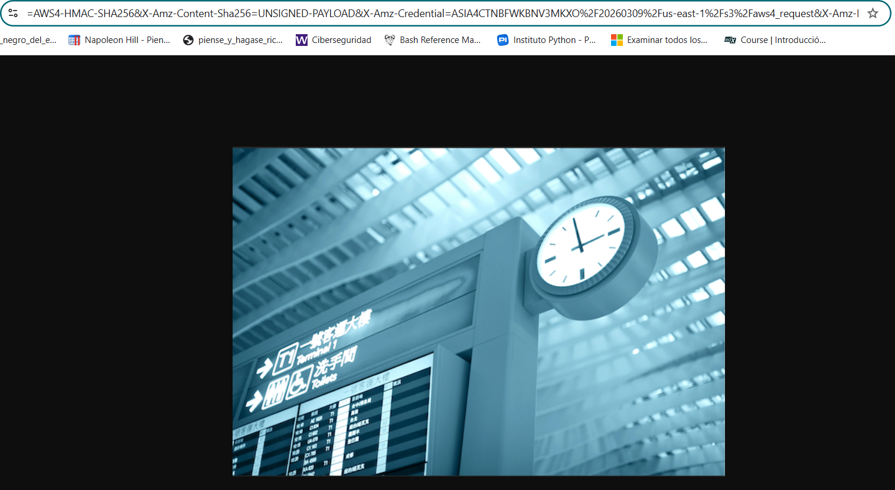

### Explicación técnica

Cuando solicitamos abrir el objeto desde la consola:

1. La consola S3 genera una URL prefirmada usando nuestras credenciales (`voclabs`)

2. S3 recibe la solicitud y ve que el objeto está cifrado con SSE-KMS

3. S3 envía la clave de datos cifrada a KMS

4. KMS verifica que tenemos permisos para usar `MyKMSKey`

5. KMS descifra la clave de datos y la devuelve a S3

6. S3 descifra el objeto y lo muestra

**Diferencia clave con Tarea 3:**

- Tarea 3: Acceso anónimo → ❌ Error

- Tarea 4: Acceso con firma (autenticado) → ✅ Éxito

### Conclusión

El cifrado con KMS **no impide el acceso a usuarios autorizados**, pero bloquea eficazmente el acceso anónimo o no autenticado, incluso si el objeto se hace público accidentalmente.

## 📊 TAREA 5: SUPERVISIÓN CON AWS CLOUDTRAIL

### Objetivo

Demostrar cómo CloudTrail registra todas las operaciones relacionadas con nuestras claves KMS, proporcionando un registro de auditoría completo.

### Procedimiento realizado

#### 5.1 Acceso a CloudTrail y filtrado

1. Navegamos a la consola de **CloudTrail**

2. Seleccionamos **Event history** (Historial de eventos)

3. Aplicamos filtro por **origen de eventos** = `kms.amazonaws.com`

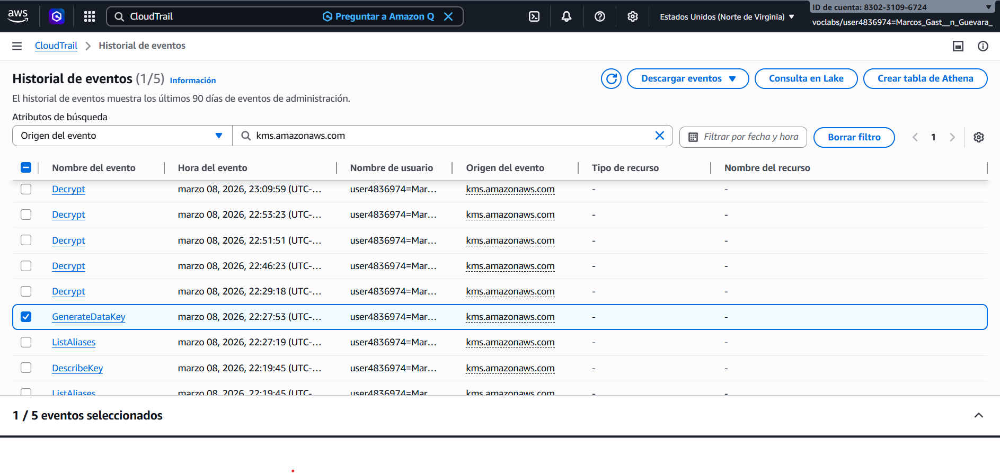

#### 5.2 Análisis del evento GenerateDataKey

Este evento se generó cuando **subimos** `clock.png` a S3 con cifrado SSE-KMS.

### Evento: GenerateDataKey

| Campo | Valor encontrado | Significado |
| :--- | :--- | :--- |
| `eventName` | GenerateDataKey | KMS generó una nueva clave de datos |
| `keyId` | arn:aws:kms:us-east-1:830231096724:key/1aa42398... | Nuestra clave `MyKMSKey` |
| `principalId` | voclabs | Quién lo solicitó (nosotros) |
| `resources[].ARN` | arn:aws:s3:::.../clock.png | El objeto que se cifraría |

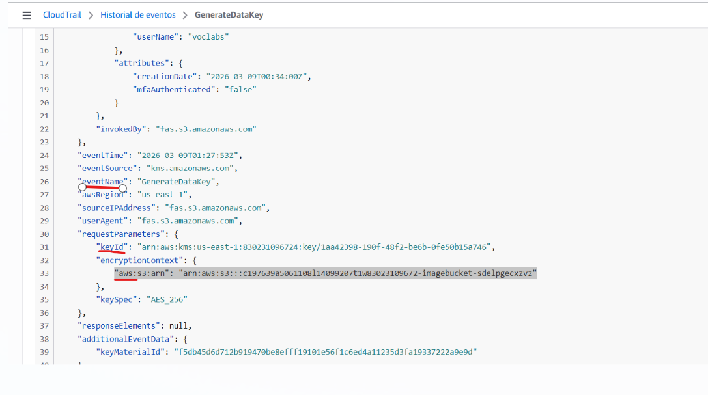

**¿Qué pasó?**

- Al subir el archivo, S3 pidió a KMS una clave de datos

- KMS registró esta operación automáticamente

- Queda evidencia de **cuándo** y **quién** cifró el objeto

#### 5.3 Análisis del evento Decrypt

Este evento se generó cuando **abrimos** `clock.png` desde la consola de S3.

Seleccionamos el evento **Decrypt** y observamos:

| Campo | Valor encontrado | Significado |
|-------|------------------|-------------|
| `eventName` | Decrypt | Se descifró algo usando nuestra clave |
| `keyId` | arn:aws:kms:us-east-1:830231096724:key/1aa42398-190f-48f2-be6b-0fe50b15a746 | Misma clave |
| `principalId` | voclabs | Mismo usuario |
| `resources\[].ARN` | arn:aws:s3:::.../clock.png | El objeto que se descifró |

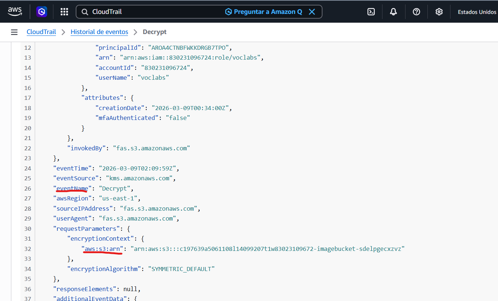

**¿Qué pasó?**

- Al abrir el archivo, S3 pidió a KMS que descifrara la clave de datos

- KMS registró esta operación

- Queda evidencia de **quién accedió al objeto descifrado**

### Conclusión sobre CloudTrail

✅ **Valor para seguridad/auditoría:**

- Podemos rastrear **CADA VEZ** que se usó nuestra clave

- Sabemos **quién** la usó (IAM user/role)

- Sabemos **qué** recurso se cifró/descifró

- Sabemos **cuándo** ocurrió (fecha y hora exacta)

- Los registros se conservan 90 días (o más si creamos un trail)

**Caso de uso real:**

Si detectamos un acceso no autorizado a datos, podemos revisar CloudTrail para ver:

- ¿Alguien usó la clave sin permiso?

- ¿Desde qué IP?

- ¿Qué objetos se descifraron?

- ¿A qué hora?

Esto es **fundamental para cumplimiento normativo** (GDPR, HIPAA, SOX) y para **investigaciones de seguridad**.

## 💾 TAREA 6: CIFRADO DEL VOLUMEN RAÍZ DE UNA INSTANCIA EC2

### Objetivo

Cifrar el volumen raíz de una instancia EC2 existente que inicialmente no tenía cifrado, demostrando el proceso completo de migración a almacenamiento cifrado sin pérdida de datos.

### Procedimiento realizado

#### 6.1 Verificación del estado inicial

1. Navegamos a la consola de EC2

2. Seleccionamos **LabInstance**

3. En la pestaña **Almacenamiento**, verificamos que el volumen raíz **NO** está cifrado

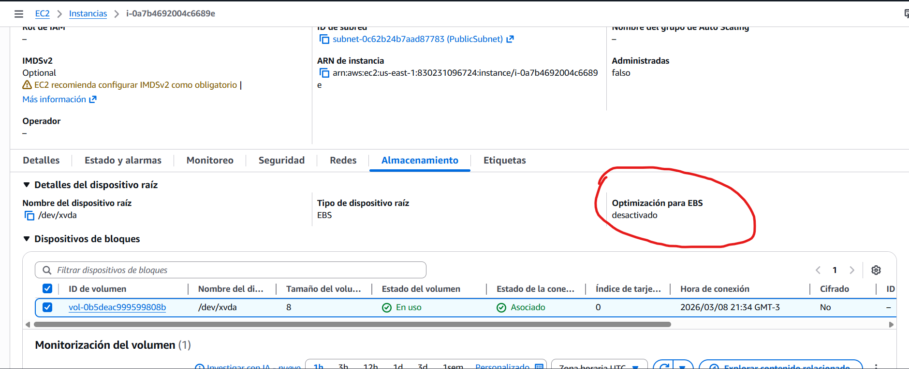

#### 6.2 Detención de la instancia

1. Seleccionamos la instancia

2. **Estado de la instancia** → **Detener instancia**

3. Confirmamos la acción y esperamos a que el estado cambie a **"detenida"**

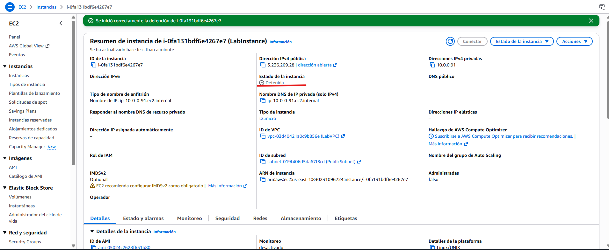

> **Nota:** Es necesario detener la instancia para poder modificar el volumen raíz.

#### 6.3 Creación de instantánea del volumen original

1. Desde la pestaña **Almacenamiento**, hicimos clic en el ID del volumen

2. Acciones → **Crear instantánea**

3. Agregamos etiqueta: **Name** = `Unencrypted Root Volume`

4. Esperamos a que el estado sea **Completado**

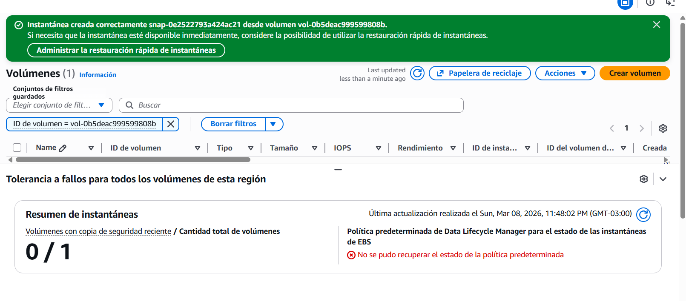

#### 6.4 Creación de volumen cifrado desde la instantánea

1. Seleccionamos la instantánea

2. Acciones → **Crear volumen a partir de instantánea**

3. Configuramos:

&nbsp;  - **Zona de disponibilidad:** `us-east-1c` (misma que la instancia)

&nbsp;  - ✅ **Cifrar este volumen**

&nbsp;  - **Clave KMS:** `MyKMSKey`

4. Creamos el volumen

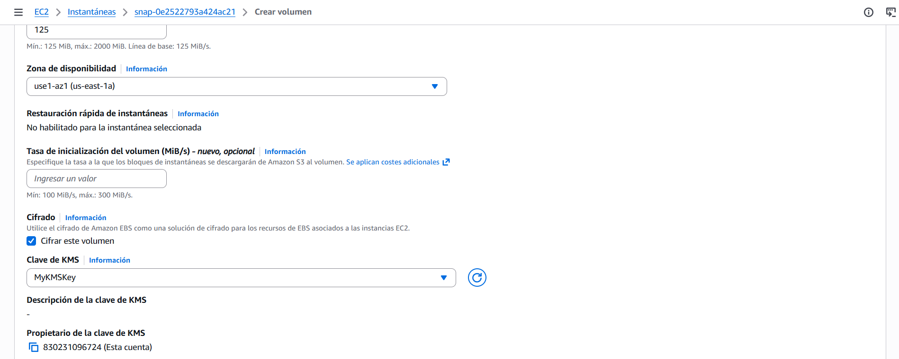

#### 6.5 Etiquetado de volúmenes

Para identificar claramente los volúmenes, los renombramos:

- **Old unencrypted root volume** (volumen original, sin cifrar)

- **New encrypted root volume** (nuevo volumen cifrado)

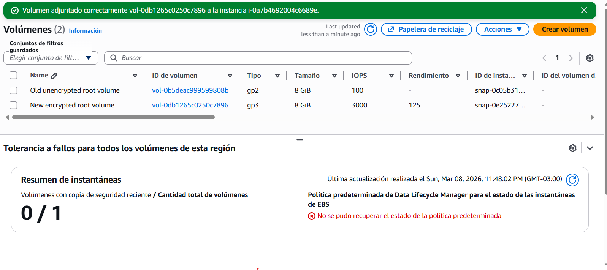

#### 6.6 Desasociación del volumen antiguo

1. Seleccionamos **Old unencrypted root volume**

2. Acciones → **Desasociar volumen**

3. Confirmamos la operación

4. Verificamos que el estado cambie a **"disponible"**

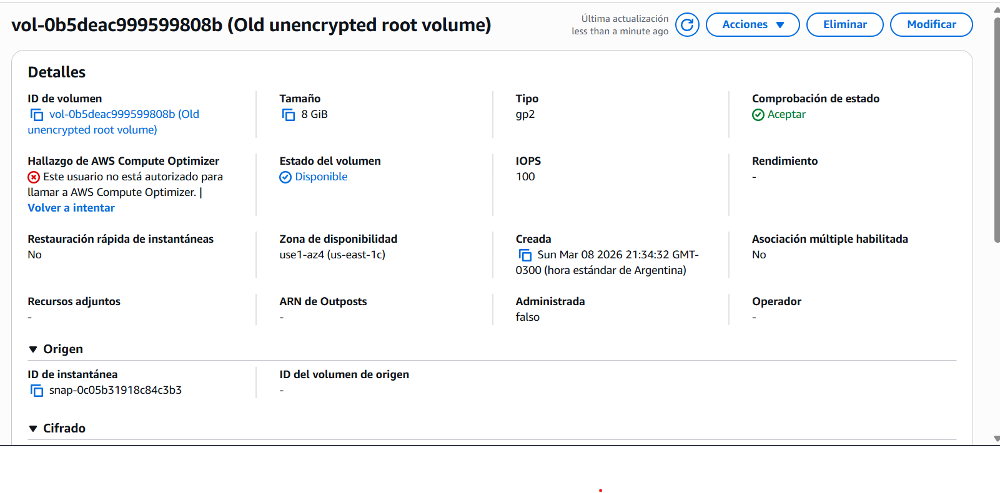

#### 6.7 Asociación del nuevo volumen cifrado

1. Seleccionamos **New encrypted root volume**

2. Acciones → **Asociar volumen**

3. Configuramos:

&nbsp;  - **Instancia:** LabInstance (detenida)

&nbsp;  - **Nombre de dispositivo:** `/dev/xvda` (dispositivo raíz)

4. Confirmamos la asociación

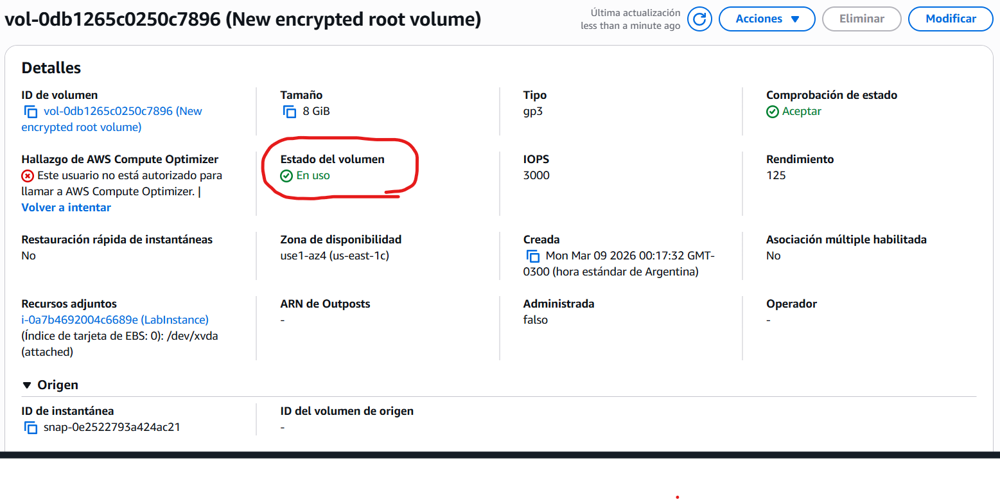

#### 6.8 Verificación del estado final

Una vez asociado, verificamos que:

- ✅ El volumen tiene **estado: en uso**

- ✅ Está adjunto a LabInstance en `/dev/xvda`

- ✅ El volumen fue creado con cifrado (aunque no siempre se muestra explícitamente en la vista de detalles)

### Explicación técnica del proceso

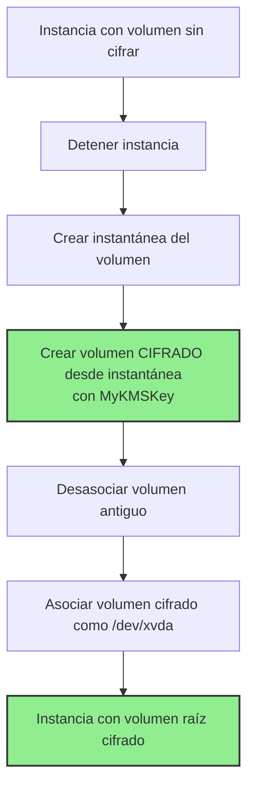

##  TAREA 7 : DESACTIVACIÓN DE LA CLAVE Y OBSERVACIÓN DE EFECTOS

### Objetivo

Demostrar el impacto de deshabilitar una clave KMS en el acceso a recursos cifrados (S3 y EBS) y cómo CloudTrail registra estos eventos.

### Procedimiento realizado

#### 7.1 Deshabilitación de la clave KMS

1. En la consola de KMS, seleccionamos **MyKMSKey**

2. **Acciones de clave** → **Desactivar**

3. Confirmamos la operación

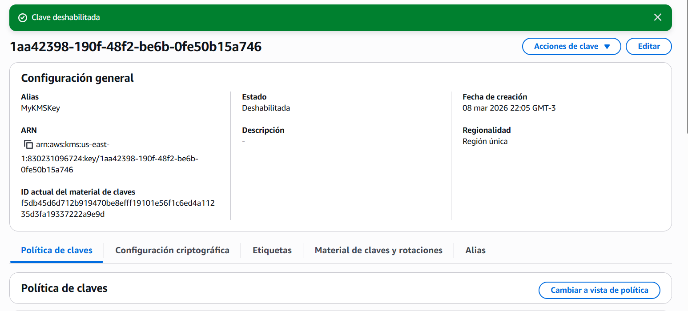

#### 7.2 Intento de iniciar la instancia EC2

1. Seleccionamos **LabInstance**

2. **Estado de la instancia** → **Iniciar instancia**

3. Observamos que la instancia **no logra iniciarse** y vuelve a estado "detenida"

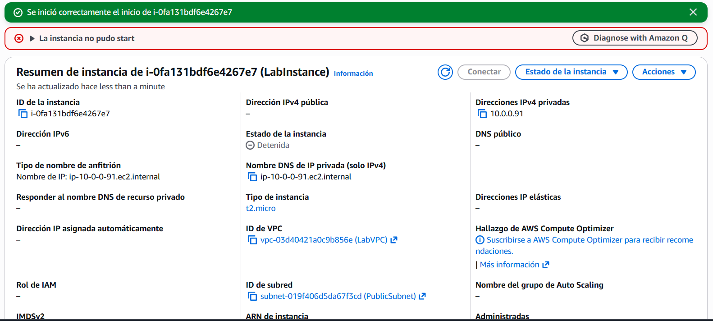

**¿Por qué?**  

El volumen raíz está cifrado con MyKMSKey. Al iniciar, EC2 necesita que KMS descifre la clave de datos del volumen. Como la clave está deshabilitada, KMS rechaza la solicitud y el arranque falla.

#### 7.3 Intento de acceder al objeto en S3

1. En S3, intentamos abrir `clock.png` desde la consola

2. Obtenemos error: **KMS.DisabledException**

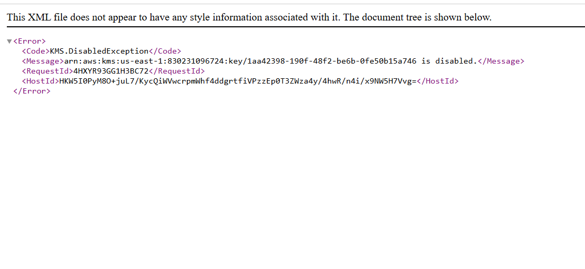

**¿Por qué?**  

El objeto está cifrado con SSE-KMS. S3 necesita que KMS descifre la clave de datos, pero la clave maestra está deshabilitada.

#### 7.4 Auditoría en CloudTrail

Revisamos el historial de eventos y encontramos:

| Evento | Hallazgo |

|--------|----------|

| **DisableKey** | Registro de cuándo deshabilitamos la clave |

| **StartInstances** | Solicitud exitosa, pero instancia no arranca |

| **CreateGrant** | Error por clave deshabilitada |

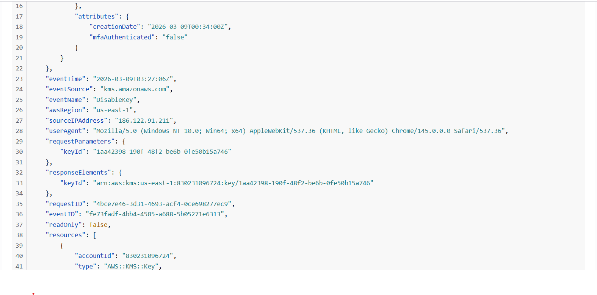

El evento **CreateGrant** muestra el error: la clave está deshabilitada, por lo que KMS no puede otorgar los permisos necesarios para descifrar el volumen.

#### 7.5 Rehabilitación de la clave y recuperación

1. Volvemos a KMS y **rehabilitamos** MyKMSKey

2. Iniciamos LabInstance nuevamente

3. ✅ La instancia arranca correctamente (estado **"En ejecución"**)

4. ✅ El objeto en S3 vuelve a ser accesible

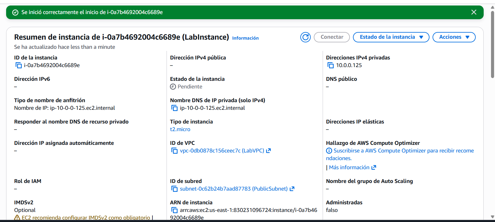

### Análisis técnico del impacto

| Recurso | Con clave habilitada | Con clave deshabilitada |

|---------|---------------------|------------------------|

| Objeto S3 | ✅ Acceso normal | ❌ KMS.DisabledException |

| Volumen EBS | ✅ Instancia inicia | ❌ Instancia no arranca |

| CloudTrail | Registra uso normal | Registra intentos fallidos |

### Lecciones clave aprendidas

1.**El cifrado es real**: Sin la clave, los datos son inaccesibles

2.**Dependencia crítica**: Servicios como EC2 y S3 dependen de KMS para operar

3.**Auditabilidad**: CloudTrail registra cada intento, exitoso o fallido

4.**Recuperabilidad**: Rehabilitar la clave restaura el acceso inmediatamente

### Conclusión final del laboratorio

Hemos demostrado un flujo completo de seguridad en AWS:

✅ Creación y gestión de claves KMS  

✅ Cifrado de objetos en S3 (SSE-KMS)  

✅ Pruebas de acceso público vs autenticado  

✅ Auditoría con CloudTrail  

✅ Cifrado de volúmenes EBS  

✅ **Demostración del impacto de deshabilitar una clave**

Este laboratorio evidencia la importancia de:

- **Proteger las claves KMS** (son la puerta a sus datos)

- **Monitorear su uso** con CloudTrail

- **Planificar la recuperación** ante deshabilitación accidental

-**Aplicar defensa en profundidad** en AWS

